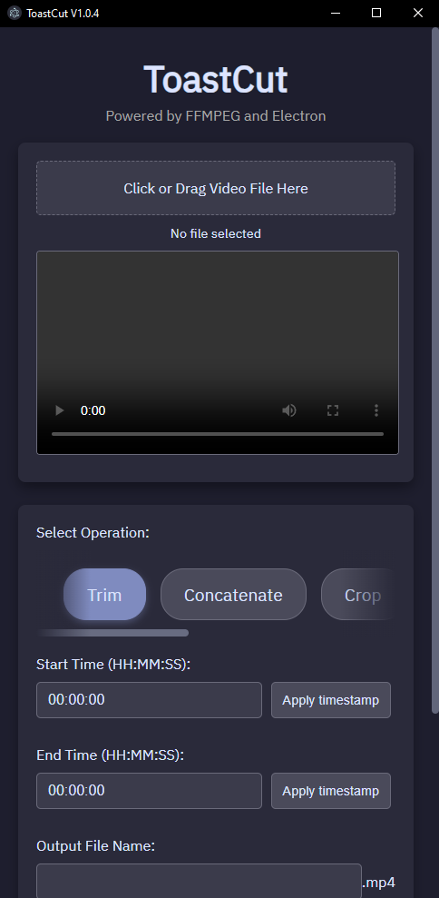

# ToastCut
Lightweight, multi-OS, lightning fast simple video editor.<br/>
<br/>
**!This program is in active alpha development and can do damage to you and your system if used improperly, use at your own discretion!**

# Description
ToastCut, previously called "toast-ffmpeg-electron", is an electron-based video editing suite, using FFMPEG for the video operations.
This program started out as a windows batch script that accepted a filename and timestamps to trim a video length. After adding thousands of "if()" statements to the program to implement other functionalities, I decided to port the program into an electron app that can work in many OS's.



## Main principles
- The program is easy to run (app rendering itself is zippy in any computer, as it's mostly just pure HTML with minimal .css).
- The program can be very simply built as a Windows, OSX, or Linux executable.
- Required user input for doing simple operations is as minimal as possible, and UI is straight-forward, with a focus on function over form.
- NO RE-ENCODING WHERE POSSIBLE! As a former user of industry standard "Pro" editing software, having to endure video re-encoding for a simple trim is stupid and unnecessary.

# How to use
Documentation on exact app usage instructions is in development. Here's a summary:
- Step 1: Drag and drop or browse a video file into the file upload dialogue in the top.
- Step 2: Select an operation to do from the dropdown list (ex. Trim)
- Step 3: Fill out textboxes and required info (for Trim, write beginning/end timestamps, or apply them from the seeker head in the video preview!)
- Step 4: Write the name of the output file, and optionally check the option to use CUDA encoding (Experimental, safe to use but performance may not be affected).
- Step 5. Click "Run FFMPEG" and look at the box below for details on operation progress. On success, the output video is saved to the program's root folder.

# Dependencies
  - FFMPEG
  - NodeJS
  - Electron-Builder
  - Electron

# Building
Follow the steps below to install the program and dependencies:
1. Install Node.js (LTS) (https://nodejs.org)
2. Install FFMPEG (https://www.ffmpeg.org/)
3. Clone the repository:
   ```
   git clone https://github.com/ToastKamiya/toastcut.git
   cd toastcut
4. Install dependencies:
   ```
   npm install
5. If not installed already, install electron-builder to build the app
   ```
   npm install -g electron-builder
6. Test the app in debug mode
   ```
   npm run start
7. Build the app executables
   ```
   npm run build
# License
This program is licensed under the GPL v3.0 general public use license. See LICENSE.txt for more details.

**FFmpeg Licensing Notice**

This application bundles FFmpeg, which is licensed under the [LGPL/GPL](https://ffmpeg.org/legal.html) license.
FFmpeg is copyright © the FFmpeg developers.

See the [FFmpeg license](https://ffmpeg.org/legal.html) for details.
